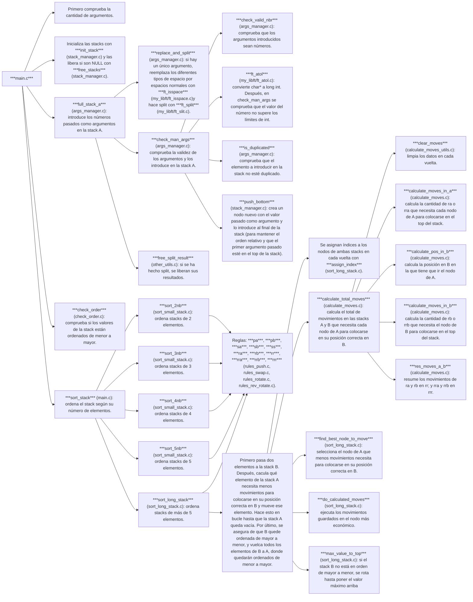

# **Push_swap**
Proyecto push_swap del cursus 42.

### ¿De qué va el proyecto?

El proyecto consiste en crear un programa que ordene de manera ascendente una lista de números enteros pasada como argumento. Se trabaja con dos stacks, el A y el B: el A es el que se recibe y el que se devuelve ordenado, el B funciona como auxiliar.

Las operaciones que se pueden utilizar son las siguientes:

- sa (swap a): intercambia los dos primeros elementos del stack A.
- sb (swap b): intercambia los dos primeros elementos del stack B.
- ss (swap a y swap b a la vez)
- pa (push a): toma el primer elemento del stack A y lo pone el primero en el stack B.
- pb (push b): toma el primer elemento del stack B y lo pone el primero en el stack A.
- ra (rotate a): Desplaza hacia arriba todos los elementos del stack A una posición; el primer elemento se convierte en el último.
- rb (rotate b): Desplaza hacia arriba todos los elementos del stack B una posición; el primer elemento se convierte en el último.
- rr (ra y rb a la vez)
- rra (reverse rotate a): Desplaza hacia abajo todos los elementos del stack A una posicion; el último elemento se convierte en el primero.
- rrb (reverse rotate b): Desplaza hacia abajo todos los elementos del stack B una posicion; el último elemento se convierte en el primero.
- rrr (rra y rrb a la vez)

El programa debe mostrar la lista de operaciones más corta posible para ordenar el stack A, de menor a mayor, situándose el elemento menor en la cima del stack.

El programa mostrará error en caso de recibir argumentos que no sean enteros, argumentos superiores a un número entero o números duplicados.

### Algoritmo de ordenamiento

***Ordenar listas cortas***

*LISTAS DE 2 ELEMENTOS:*

Para ordenar de menor a mayor una lista de dos elementos basta con un solo movimiento.

*LISTAS DE 3 ELEMENTOS:*

El máximo de movimientos para ordenar una lista de tres elementos son dos. 

Si la lista mantiene un orden circular o cíclico, pero no lineal (como en el caso de 2 - 3 - 1 y 3 - 1 - 2), basta con un solo movimiento para ordenarla en modo lineal. 

Si la lista no mantiene un orden circular (como en el caso de 1 - 3 - 2, 2 - 1 - 3 y 3 - 2 - 1), necesita máximo dos movimientos para quedar ordenada.

*LISTAS DE 4 ELEMENTOS:*

Para ordenar las listas de 4 elementos, pasamos el primer elemento al stack B, ordenamos los tres elementos que quedan en el stack A utilizando la función para listas de 3 elementos, y devolvemos el elemento del stack B a su posición correcta en el stack A.

El máximo de movimientos necesarios para ordenar una lista de 4 elementos son siete.

*LISTAS DE 5 ELEMENTOS:*

Para ordenar las listas de 5 elementos, pasamos el primer elemento al stack B, ordenamos los elementos restantes llamando a la función que ordena 4 elementos. Luego devolvemos el elemento del stack B que queda a su posición correcta en A. Esto nos permitirá ordenar la lista en no más de 12 movimientos, que es lo que se pide en la hoja de corrección.

***Ordenar listas largas***

*LISTAS DE MÁS DE 5 ELEMENTOS:*

Pasos: 

1. Calcular la cantidad de movimientos que necesita cada elemento del stack A para situarse en la cima de su stack. Serán movimientos ra o rra, dependiendo de si el elemento en cuestión se encuentra en la mitad superior o inferior de la pila.

   Por ejemplo, el número 3, como es el primer elemento de la lista, no necesita ningún movimiento (ejemplo 1).

   El número 7, siendo el segundo elemento de la lista, necesita un movimiento (ra) para ubicarse en la cima de la stack (ejemplo 2).

   El número 1 necesitaría dos movimientos (ra, ra) (ejemplo 3).

   El número 0, que se encuentra al final de la lista, necesita un solo movimiento para colocarse en la cima (rra) (ejemplo 4).

3. Calcular la posición en la que cada elemento de A tendría que ubicarse al moverlo a B, teniendo en cuenta que en B queremos ordenarlos de mayor a menor, para que cuando los volquemos de nuevo en A, queden ordenados de menor a mayor.
4. Calcular los movimientos que se necesitarían en el stack B para llevar el nodo sobre el que tiene que ir el elemento de A a la cima de la pila.
5. Resumir los movimientos: ra y rb se convierten en rr y rra y rrb se convierten en rrr.
6. Encontrar cuál es el elemento de A más económico, que menos movimientos necesita para moverse a B.
7. Ejecutar los movimientos para ese elemento.
8. Repetir hasta vaciar A.
9. Y luego volcar todos los elementos a A.

### Flujo de push_swap

### Recursos
Explicaciones del algoritmo &rarr; [AQUÍ](https://medium.com/@jamierobertdawson/push-swap-the-least-amount-of-moves-with-two-stacks-d1e76a71789a) y [AQUÍ](https://medium.com/@ayogun/push-swap-c1f5d2d41e97)

Hoja de corrección &rarr; [AQUÍ](https://github.com/rizky/42-corrections/blob/master/push_swap.pdf)

Visualizer &rarr; [AQUÍ](https://github.com/o-reo/push_swap_visualizer)
